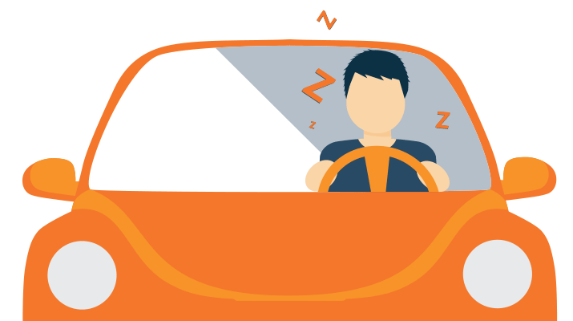
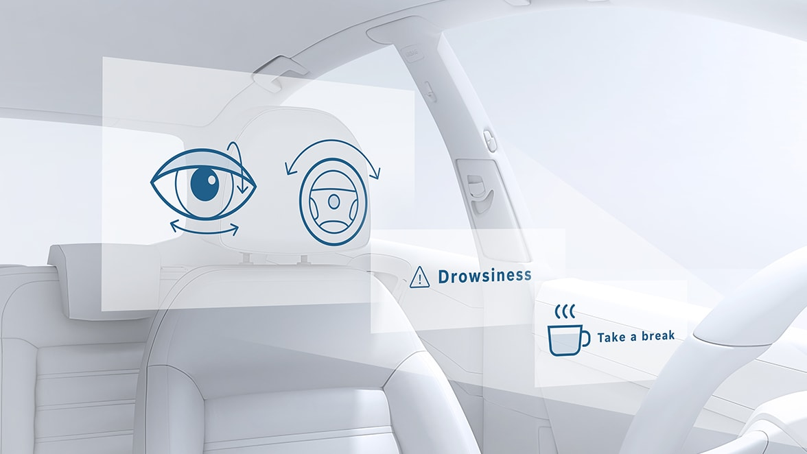
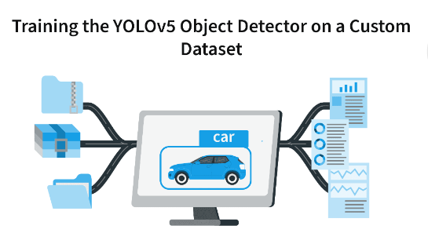
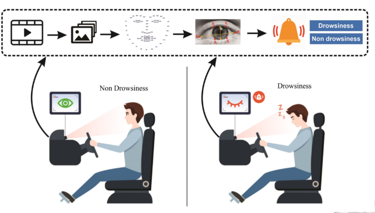

# Drowsiness

Demo : https://v-it.in/ZOV08M3CR

## Problem Statement
Driver drowsiness and fatigue are two of the most common causes of car accidents.
Every year, the number of deaths and fatalities increases over the world.
You need to create an app to reduce the frequency of accidents caused by driver
weariness and so improve transportation safety with the help of this project; this system
deals with automatic driver sleepiness detection based on visual information. You can
try a method for measuring PERCLOS, a scientifically established measure of tiredness
linked with slow eye closure, by locating, tracking, and analyzing both the driver's face
and eyes.
Many drivers and workers' lives are put at jeopardy due to drowsiness. To identify the
onset of drowsiness, it is critical to design realistic and easy-to-deploy real-world
solutions.
The goal of this project is to create an app that can detect driver drowsiness in real time.

# Architecture

# Solution

The purpose of the drowsiness detection system is to aid in the prevention of accidents passenger and commercial vehicles. The system will detect the early symptoms of drowsiness before the driver has fully lost all attentiveness and warn the driver that they are no longer capable of operating the vehicle safely.

#  Contributer
- Bhavya M Shah
